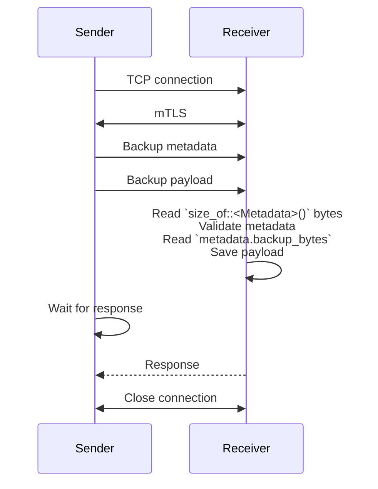
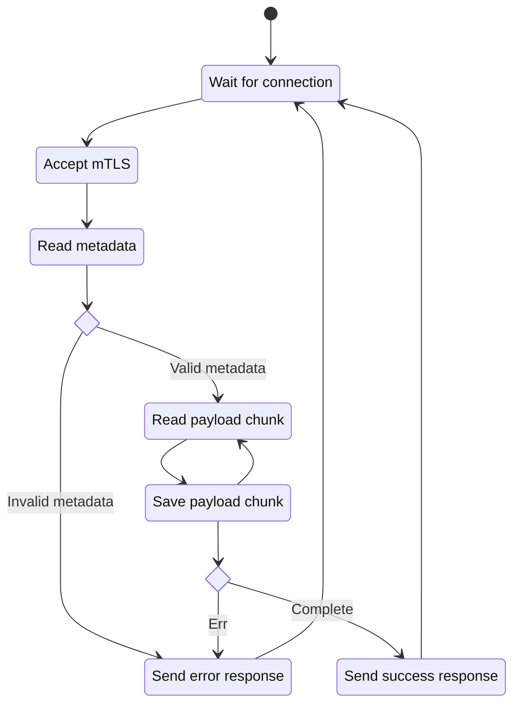

# Backups

## Design

* A backup is a blob of bytes that gets saved as a single file.
* A backup sender may backup many services.
* Each service is backed up at set cadences, e.g., Hourly, Daily, Weekly, etc.
* The receiver will save up to $N$ files for a given cadence per service, e.g., 24 Hourly backups.
* The sender and receiver communicate directly using a TCP connection secured using mTLS.

### Communication

The messages between the sender and receiver are the direct bytes backing the data types rather than serializing as JSON:

```rust
#[repr(C)]
pub struct Metadata {
    /// Backup size in bytes.
    pub backup_bytes: u64,

    /// The name of the service this backup is for.
    pub service_name: [u8; 128], // Stack allocated string containing only [a-zA-Z0-9_\-\0].

    /// The cadence of this backup
    pub cadence: Cadence, // Enum represented by u64.

    /// The file extension for the backup.
    pub file_extension: [u8; 32], // Stack allocated string containing only [a-zA-Z0-9_\-\0].
    
    /// The endian of the numbers in the struct.
    pub endian: Endian, // Enum represented by u8.

    /// Padding to ensure remaining memory is not uninitialised for Metadata.
    padding: [u8; 15],
}
```

To safely send the struct between the two applications:

* The endian-sensitive fields are converted to native endian from the sender's endian when converting from bytes.
* An intermediate type where the enums are represented by their underlying type is used to validate enum values without creating an invalid instance of the enum.
* `#[repr(C)]` ensures a consistent layout of the struct in memory between compilations.
* Tests ensure the structure contains no padding/uninitialised memory.
* [miri](https://github.com/rust-lang/miri) is used to detect undefined behaviour.




### Receiver design



## Background task

* Linux: `nohup ./backup-sender &>/dev/null &`
* Windows: `start backup-receiver.exe`
