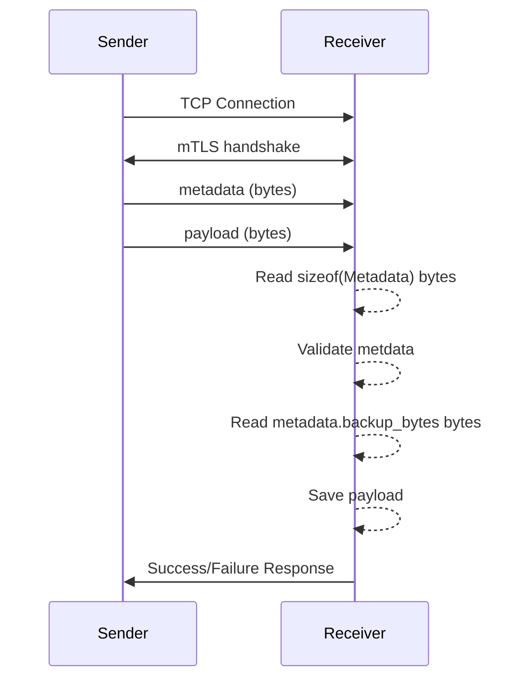

# Backups

## Backup structure

* A service is an application or part of an application that needs backing up.
* A backup is a stream of bytes that will get written to a single file.
* The Sender creates backups of a service at given cadences, e.g., hourly and weekly.
* The Receiver stores up to $N$ backups for that cadance of that service.

For example, the sender is configured to create Hourly and Weekly backups of Assignment Tracker's database. The Receiver is configured to store up to 24 Hourly backups per service, and up to 52 Weekly backups per service.

* Backups are saved by the receiver as `{SERVICE_NAME}/{CADANCE}/{DATE_TIME}.{EXTENSION}`

## Message Protocol

mTLS to verify the identity of both parties.

A backup contains two parts:
* The metadata
* The payload

The metadata is defined as:

```rust
pub struct BackupMetadata {
   /// Backup size in bytes.
    pub backup_bytes: u64,

    /// The name of the service this backup is for.
    pub service_name: [u8; 128],

    /// The cadance of this backup
    pub cadance: Cadance, // u64 enum

    /// The file extension for the backup.
    pub file_extension: [u8; 32],
}
```

Communication is done by validating then directly iterpreting bytes as a given datatype.

For example, the metadata:

```rust
BackupMetadata {
    backup_bytes: 9601,
    service_name: "Assignment Tracker\0".bytes(),
    cadance: Cadance::Weekly,
    file_extension: "sql\0".bytes(),
}
```

will be sent as:

```
// backup_bytes
00100101 10000001

// service_name
01000001 01110011 01110011 01101001 01100111 01101110 01101101 01100101 01101110 01110100 00100000
01010100 01110010 01100001 01100011 01101011 01100101 01110010 00000000 00000000 00000000 00000000
00000000 00000000 00000000 00000000 00000000 00000000 00000000 00000000 00000000 00000000 00000000
00000000 00000000 00000000 00000000 00000000 00000000 00000000 00000000 00000000 00000000 00000000
00000000 00000000 00000000 00000000 00000000 00000000 00000000 00000000 00000000 00000000 00000000
00000000 00000000 00000000 00000000 00000000 00000000 00000000 00000000 00000000 00000000 00000000
00000000 00000000 00000000 00000000 00000000 00000000 00000000 00000000 00000000 00000000 00000000
00000000 00000000 00000000 00000000 00000000 00000000 00000000 00000000 00000000 00000000 00000000
00000000 00000000 00000000 00000000 00000000 00000000 00000000 00000000 00000000 00000000 00000000
00000000 00000000 00000000 00000000 00000000 00000000 00000000 00000000 00000000 00000000 00000000
00000000 00000000 00000000 00000000 00000000 00000000 00000000 00000000 00000000 00000000 00000000
00000000 00000000 00000000 00000000 00000000 00000000 00000000

// Cadance
00000000 00000010

// file_extension
01110011 01110001 01101100 00000000 00000000 00000000 00000000 00000000 00000000 00000000 00000000
00000000 00000000 00000000 00000000 00000000 00000000 00000000 00000000 00000000 00000000 00000000
00000000 00000000 00000000 00000000 00000000 00000000 00000000 00000000 00000000 00000000
```

