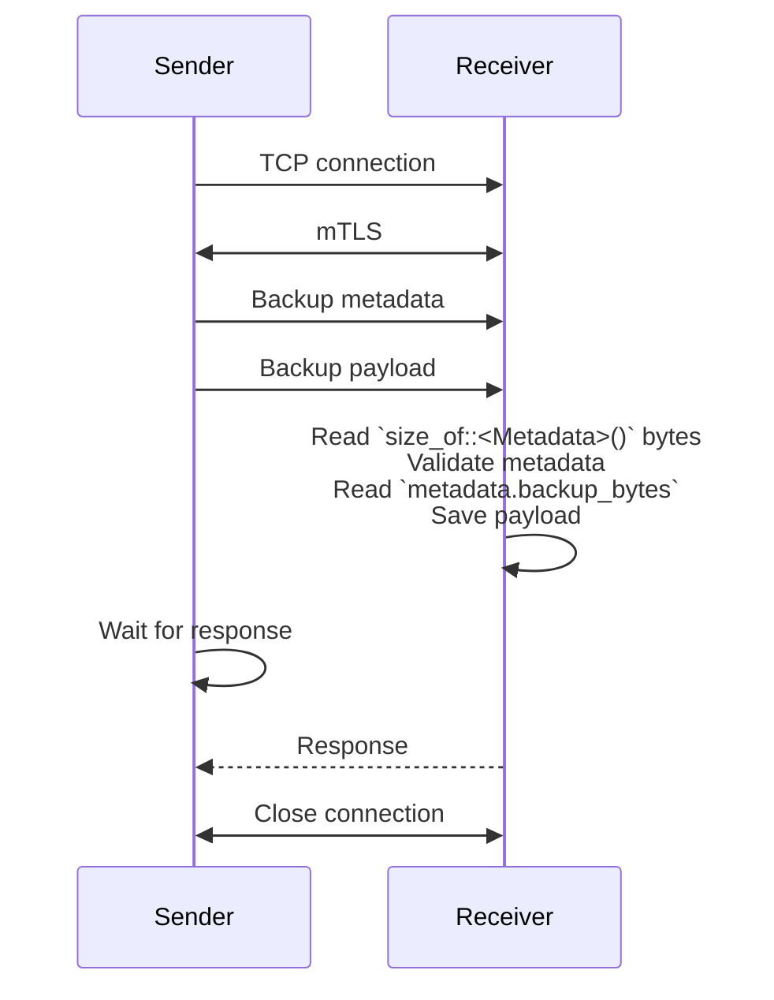

# Backups

## Design

* A backup is a blob of bytes that gets saved as a single file.
* A backup sender may backup many services.
* Each service is backed up at set cadances, e.g., Hourly, Daily, Weekly, etc.
* The receiver will save up to $N$ files for a given cadance per servide, e.g., 24 Hourly backups.
* The sender and receiver communicate directly using a TCP connection secured using mTLS.

### Communication

The messages between the sender and receiver are the direct bytes backing the data types rather than serializing as JSON:

```rust
#[repr(C)]
pub struct Metadata {
    /// Backup size in bytes.
    pub backup_bytes: u64,

    /// The name of the service this backup is for.
    pub service_name: [u8; 128], // Stack allocated string containing only [a-zA-Z0-9_\-\0].

    /// The cadance of this backup
    pub cadance: Cadance, // Enum represented by u64.

    /// The file extension for the backup.
    pub file_extension: [u8; 32], // Stack allocated string containing only [a-zA-Z0-9_\-\0].
}
```

To safely send the struct between the two applications:

* The `backup_bytes` and `cadance` are converted from native endian to big endian when being sent.
* `#[repr(C)]` ensures a consistant layout of the struct in memory between compilations.
* Care is taken to ensure the struct has no padding between fields.




### Receiver design


## Background task

* Linux: `nohup ./backup-sender &>/dev/null &`
* Windows: `start backup-receiver.exe`
